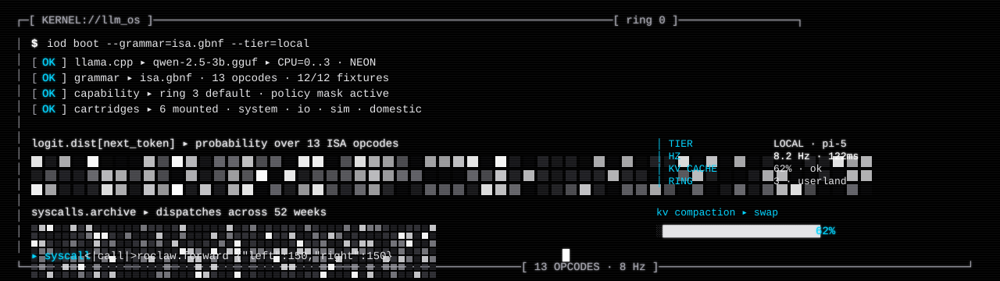
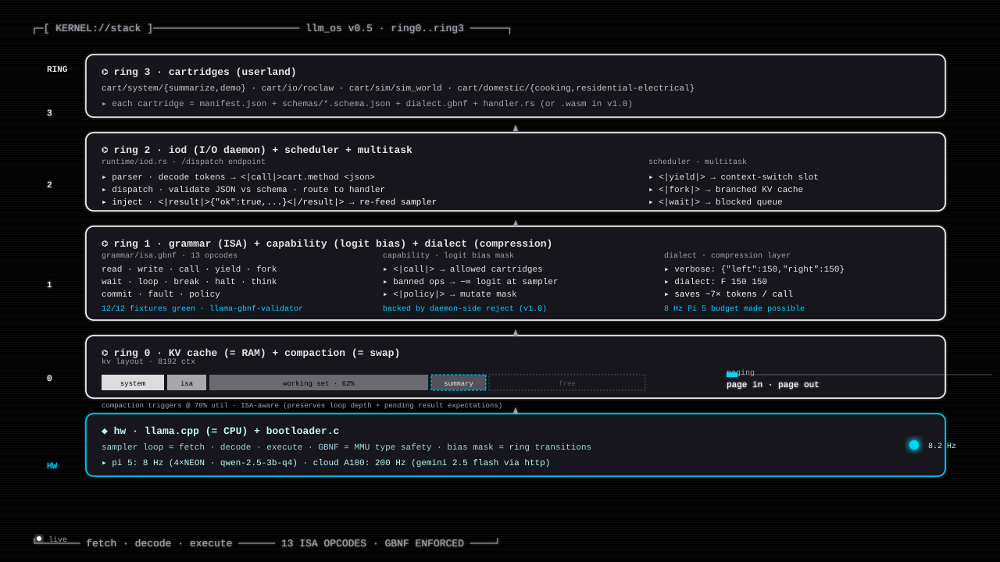

<!--
  README — llm_os
  Tron-monochrome aesthetic. Pure black + grayscale + cyan accent.
  Pairs with the orange-Ares skillos_mini and green-MCP RoClaw repos.
  GitHub renders the SVG banners below natively (SMIL animations included).
-->

<p align="center">
  
</p>

<p align="center">
  <strong><code>LLM_OS</code></strong> &nbsp;//&nbsp; an operating system where the LLM is the CPU.<br/>
  <sub>13-opcode ISA over <a href="https://github.com/ggerganov/llama.cpp"><code>llama.cpp</code></a> · GBNF as MMU · KV cache as RAM · compaction as swap · sampler loop as fetch-decode-execute.</sub>
</p>

<p align="center">
  <a href="#"></a>
  <a href="#"></a>
  <a href="#"></a>
  <a href="LICENSE"></a>
</p>

<p align="center">
  
</p>

## ▸ what this is

`llm_os` is **not** an agent framework. It is an **operating system
architecture** where the language model itself plays the role of the CPU
and the rest of the runtime is built around it the way Linux is built
around x86.

```
  POSIX                          ←→  LLM-OS
  ────────────────────────────────────────────────────────────
  CPU instruction set            ←→  13-opcode ISA (GBNF tokens)
  RAM                            ←→  KV cache
  MMU / type safety              ←→  GBNF grammar (sampler-enforced)
  Swap                           ←→  KV compaction (ISA-aware)
  Ring 0 / Ring 3                ←→  Logit bias capability mask
  Syscall interface              ←→  <|call|> opcode + cartridge schema
  /proc                          ←→  /trace · /policy daemon endpoints
  Kernel module                  ←→  Cartridge (manifest + schemas + handler)
```

The 13 opcodes are the ISA. The GBNF grammar is the type system enforced
by the sampler — wrong sequences are *physically impossible* to emit,
not just rejected after the fact. The KV cache is the working memory
that gets swapped (compacted) when full. Cartridges are the syscall
table. The I/O daemon (`iod`) is the kernel.

> **Companion repos.** `llm_os` is the kernel layer of a three-part
> ecosystem:
> - [`skillos_mini`](https://github.com/EvolvingAgentsLabs/skillos_mini) — prefrontal cortex (Ares-orange aesthetic)
> - [`RoClaw`](https://github.com/EvolvingAgentsLabs/RoClaw) — cerebellum (MCP-green aesthetic)
> - **`llm_os`** (this repo) — kernel (white-on-black aesthetic)

<p align="center">
  
</p>

## ▸ the 13-opcode ISA

| Opcode | Arity | Form | Daemon response |
|---|---|---|---|
| `<\|read\|>` | fd, len | `<\|read\|>fd=N len=N` | `<\|result\|>…<\|/result\|>` |
| `<\|write\|>` | fd, payload | `<\|write\|>fd=N <json>` | `<\|ack\|>` |
| `<\|call\|>` | cart.method, args | `<\|call\|>cart.method <json> <\|/call\|>` | `<\|result\|>…<\|/result\|>` |
| `<\|yield\|>` | — | `<\|yield\|>` | (scheduler swap) |
| `<\|fork\|>` | goal | `<\|fork\|>goal=<label>` | — |
| `<\|wait\|>` | fd | `<\|wait\|>fd=N` | `<\|result\|>…<\|/result\|>` |
| `<\|loop\|>` | goal | `<\|loop\|>goal=<label> … <\|break\|>` | — |
| `<\|break\|>` | — | `<\|break\|>` | — |
| `<\|halt\|>` | status | `<\|halt\|>status=success\|failure\|partial` | (program ends) |
| `<\|think\|>` | prose | `<\|think\|>…<\|/think\|>` | — |
| `<\|commit\|>` | json | `<\|commit\|><json>` | — |
| `<\|fault\|>` | json | `<\|fault\|><json>` | `<\|result\|>…<\|/result\|>` |
| `<\|policy\|>` | — | `<\|policy\|>` | `<\|result\|>…<\|/result\|>` |

**Grammar invariants** (the GBNF makes these structurally impossible):

1. `<|halt|>` only at loop depth 0 — runaway is a compile error, not a behavior.
2. Every `<|loop|>` matched by a terminal `<|break|>`.
3. `<|break|>` only inside loops.
4. Every `<|read|>` / `<|call|>` / `<|wait|>` / `<|fault|>` / `<|policy|>` is followed by a `<|result|>` block injected by the daemon — the grammar predicts the shape.

Full spec: [`grammar/isa-spec.md`](grammar/isa-spec.md).

<p align="center">
  
</p>

## ▸ the stack · live mockup

Every layer is real code. The diagram below is the runtime state on a
Pi 5 holding 8.2 Hz.

<p align="center">
  
</p>

| Ring | Layer | Where it lives |
|---|---|---|
| **3** | userland · cartridges | [`cart/`](cart/) — manifest + schemas + dialect + handler |
| **2** | iod · scheduler · multitask | [`runtime/iod.rs`](runtime/iod.rs) · [`runtime/scheduler.rs`](runtime/scheduler.rs) · [`runtime/multitask.rs`](runtime/multitask.rs) |
| **1** | grammar · capability · dialect | [`grammar/isa.gbnf`](grammar/isa.gbnf) · [`runtime/capability.rs`](runtime/capability.rs) · [`runtime/dialect.rs`](runtime/dialect.rs) |
| **0** | KV cache + compaction | [`runtime/swap.rs`](runtime/swap.rs) — compaction with ISA awareness |
| **HW** | llama.cpp · bootloader | [`runtime/bootloader.c`](runtime/bootloader.c) · sampler loop = fetch-decode-execute |

<p align="center">
  
</p>

## ▸ demo loop · 60 seconds

```
┌──[ KERNEL://llm_os · v0.5-rc1 ]───────────────────────────────────────┐
│                                                                        │
│  $ ./scripts/quickstart.sh                                            │
│                                                                        │
│  [OK] llama.cpp     ▸ qwen-2.5-3b-q4.gguf · 4×NEON · KV=8192 ctx      │
│  [OK] grammar       ▸ isa.gbnf · 13 opcodes · 12/12 fixtures green    │
│  [OK] iod           ▸ unix:/run/llm_os/iod · /dispatch /trace /policy │
│  [OK] cartridges    ▸ system/{summarize,demo} · io/roclaw · sim       │
│                                                                        │
│  $ curl localhost:8080/dispatch -d '{"goal":"summarize ./README.md"}' │
│                                                                        │
│  ▸ token decode  ▸ <|call|>system.summarize {"path":"./README.md"}    │
│  ▸ schema check  ▸ ✓ matches cart/system/summarize/schemas/...        │
│  ▸ handler.rs    ▸ 14 ms                                              │
│  ▸ inject result ▸ <|result|>{"text":"...","len":118}<|/result|>      │
│  ▸ token decode  ▸ <|halt|>status=success                             │
│                                                                        │
│  ▸ 8.2 Hz steady · KV=62% · 0 faults                                  │
│                                                                        │
└──────────────────────────────────────────── ring 0 · userland ─────────┘
```

The same goal can be replayed with `--tier=cloud` to escalate to a
Gemini 2.5 Flash worker for heavier planning, or with `--trace` to dump
the full token stream and KV utilization timeline.

<p align="center">
  
</p>

## ▸ what's in the box

### grammar · the type system

- [`grammar/isa.gbnf`](grammar/isa.gbnf) — the 13-opcode ISA as GBNF.
- [`grammar/isa-spec.md`](grammar/isa-spec.md) — semantics, invariants,
  legal/illegal examples (12 fixtures, 6 each).
- [`scripts/validate_grammar.sh`](scripts/validate_grammar.sh) — runs
  `llama-gbnf-validator` over every fixture.

### runtime · the kernel

- [`runtime/bootloader.c`](runtime/bootloader.c) — minimal C bootstrap
  that mmaps the GGUF and hands control to llama.cpp.
- [`runtime/iod.rs`](runtime/iod.rs) — the I/O daemon. Owns the dispatch
  pipeline (`/dispatch`), the trace endpoint, and the policy mask.
- [`runtime/dispatch.rs`](runtime/dispatch.rs) — token-stream parser →
  syscall lookup → schema validation → handler invocation → result
  injection.
- [`runtime/parser.rs`](runtime/parser.rs) — ISA tokenizer. Streams
  tokens into typed `Op` events.
- [`runtime/handlers.rs`](runtime/handlers.rs) — the bootstrap handlers
  (in-process, will move to WASM in v1.0; see
  [`docs/NEXT_STEPS.md §4`](docs/NEXT_STEPS.md)).
- [`runtime/scheduler.rs`](runtime/scheduler.rs),
  [`runtime/multitask.rs`](runtime/multitask.rs) — `<|yield|>`,
  `<|fork|>`, `<|wait|>` handling.
- [`runtime/capability.rs`](runtime/capability.rs) — logit bias mask
  enforcing the current policy set.
- [`runtime/dialect.rs`](runtime/dialect.rs) — token-economy
  compression layer (`F 150 150` instead of `{"left":150,"right":150}`).
- [`runtime/swap.rs`](runtime/swap.rs) — KV compaction. Triggers at 70%
  utilization; v1.0 will preserve loop depth and pending state
  ([`docs/NEXT_STEPS.md §2`](docs/NEXT_STEPS.md)).
- [`runtime/cloud.rs`](runtime/cloud.rs),
  [`runtime/subagent.rs`](runtime/subagent.rs) — dual-brain routing.
  Cartridges with `preferred_tier: "cloud"` escalate to a remote worker.

### cartridges · the syscall table

```
cart/
├── system/
│   ├── summarize/        — text summarization (cheap)
│   └── demo/             — round-trip echo for tests
├── io/
│   └── roclaw/           — physical robot tool surface (RoClaw)
├── sim/
│   └── sim_world/        — MuJoCo simulation tool surface
└── domestic/
    ├── cooking/          — recipe / menu / shopping list
    └── residential-electrical/   — IEC 60364 design + compliance
```

Each cartridge is `manifest.json` + `schemas/*.schema.json` +
`dialect.gbnf` + a Rust handler (transitioning to WASM in v1.0).

### tests · safety net

- [`tests/e2e/`](tests/e2e/) — end-to-end fixtures driving real iod
  through real cartridges with a mock llama-server.
- [`tests/legal/`](grammar/tests/legal/) and
  [`tests/illegal/`](grammar/tests/illegal/) — grammar fixtures that
  must / must not parse.
- [`runtime/tests/`](runtime/tests/) — Rust unit + integration tests.

<p align="center">
  
</p>

## ▸ repo layout

```
llm_os/
├── README.md                           ← This file.
├── docs/
│   ├── ARCHITECTURE.md                 ← Full architecture + Mermaid diagrams.
│   ├── TUTORIAL.md                     ← Author your first cartridge.
│   ├── USAGE.md                        ← Operator guide.
│   ├── NEXT_STEPS.md                   ← Roadmap from architecture review.
│   └── assets/                         ← Animated SVG banners + dividers.
├── grammar/
│   ├── isa.gbnf                        ← The 13-opcode ISA.
│   ├── isa-spec.md                     ← Semantics + invariants.
│   └── tests/{legal,illegal}/          ← Grammar fixtures.
├── runtime/                            ← Rust kernel + C bootloader.
├── cart/                               ← Cartridges (syscall table).
├── design/                             ← Design docs + thesis.
├── scripts/                            ← quickstart · validate · promote_traces.
├── tests/                              ← E2E fixtures.
├── agents/                             ← Markdown agent definitions.
└── RELEASE_NOTES_v{0.1,0.5}.md         ← Version notes.
```

<p align="center">
  
</p>

## ▸ quick start

### prerequisites

```
  ┌─────────────────────────────────────────────────────────────┐
  │  llama.cpp        built from source · with --grammar       │
  │  Rust             ≥ 1.75 (cargo, rustc)                    │
  │  Python           ≥ 3.10 (validation scripts only)         │
  │  GGUF weights     qwen-2.5-3b-q4 (default) or compatible   │
  └─────────────────────────────────────────────────────────────┘
```

### one-shot bootstrap

```bash
git clone https://github.com/EvolvingAgentsLabs/llm_os.git
cd llm_os
./scripts/quickstart.sh
```

That script:
1. Builds the runtime (`cargo build --release`).
2. Validates the grammar (`scripts/validate_grammar.sh` → 12/12 green).
3. Boots `iod` listening on `unix:///run/llm_os/iod`.
4. Echoes a smoke test goal through `/dispatch`.

### dispatch a goal

```bash
curl -X POST http://localhost:8080/dispatch \
     -H 'Content-Type: application/json' \
     -d '{"goal":"summarize the file at ./grammar/isa-spec.md"}'
```

Response:
```json
{
  "trace_id": "trace_2026-04-26-1542-a7f3",
  "tier": "local",
  "ops": [
    { "op": "call", "cart": "system.summarize", "args": { "path": "..." }, "ms": 14 },
    { "op": "halt", "status": "success" }
  ],
  "kv_pct": 62,
  "hz": 8.2
}
```

### inspect runtime state

```bash
curl http://localhost:8080/trace          # last N dispatches
curl http://localhost:8080/policy         # current capability mask
curl http://localhost:8080/cartridges     # mounted syscalls
```

See [`docs/USAGE.md`](docs/USAGE.md) for the full operator guide and
[`docs/TUTORIAL.md`](docs/TUTORIAL.md) to author your own cartridge.

<p align="center">
  
</p>

## ▸ the cognitive trinity

```
   user goal
       │
       ▼
   ┌──────────────────────┐
   │   skillos / skillos_mini   ←  PREFRONTAL CORTEX   ←  Ares orange  │
   │   plan · learn · dream                                            │
   └──────────────────────┘
              │ HTTP
              ▼
   ┌──────────────────────┐
   │   llm_os (this repo)       ←  KERNEL              ←  white-on-black │
   │   ISA · GBNF · iod · KV                                           │
   └──────────────────────┘
              │ <|call|>roclaw.forward / sim.step / ...
              ▼
   ┌──────────────────────┐
   │   RoClaw / sim_world       ←  CEREBELLUM          ←  MCP green   │
   │   perceive · move                                                  │
   └──────────────────────┘
```

`skillos` plans. `llm_os` is what runs underneath the planner — the
ISA + scheduler + memory model. `RoClaw` is one of the cartridges
exposed via `<|call|>roclaw.*`. Each layer is swappable.

<p align="center">
  
</p>

## ▸ status

```
  ┌──────────────────────────────────────────────────────────────┐
  │  GRAMMAR        12/12 fixtures green                       ✓ │
  │  ISA            13 opcodes · 5 invariants enforced         ✓ │
  │  RUNTIME        v0.5-rc1 · scheduler · multitask · capability │
  │  CARTRIDGES     6 mounted · cooking · electrical · roclaw    │
  │  PI 5           8.2 Hz steady · q4_k_m                       │
  │  CLOUD          Gemini 2.5 Flash · 200 Hz                    │
  │  WASM SANDBOX   pending v1.0  (NEXT_STEPS §4)                │
  │  KV-AWARE SWAP  pending v1.0  (NEXT_STEPS §2)                │
  └──────────────────────────────────────────────────────────────┘
```

Six items in the [`docs/NEXT_STEPS.md`](docs/NEXT_STEPS.md) roadmap
take this from v0.5 to v1.0 — the most consequential is item §1
(in-llama.cpp grammar swap) which removes the per-syscall HTTP stutter
that currently caps Pi 5 at 8 Hz.

## ▸ license

Apache 2.0.

## ▸ reading order

1. [`grammar/isa-spec.md`](grammar/isa-spec.md) — the ISA itself.
   Read this first.
2. [`docs/ARCHITECTURE.md`](docs/ARCHITECTURE.md) — the kernel
   architecture + ring model.
3. [`docs/USAGE.md`](docs/USAGE.md) — operator guide.
4. [`docs/TUTORIAL.md`](docs/TUTORIAL.md) — author your own
   cartridge.
5. [`docs/NEXT_STEPS.md`](docs/NEXT_STEPS.md) — the v1.0 roadmap.

<p align="center">
  
</p>

<p align="center">
  
</p>

<p align="center">
  <sub><code>// END_OF_TRANSMISSION  ·  KERNEL://llm_os // 13 ISA · 5 INVARIANTS</code></sub>
</p>
