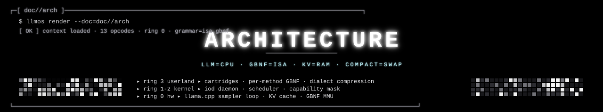
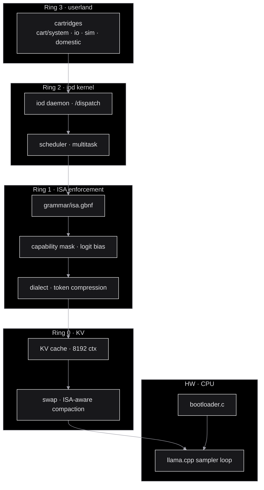
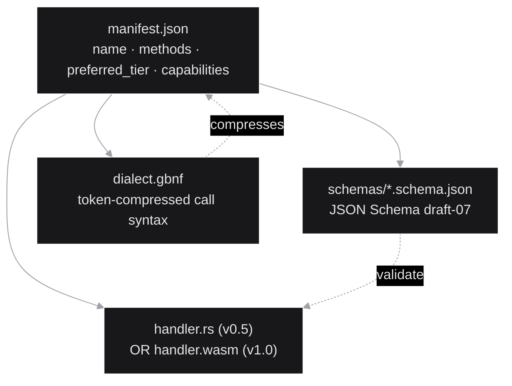
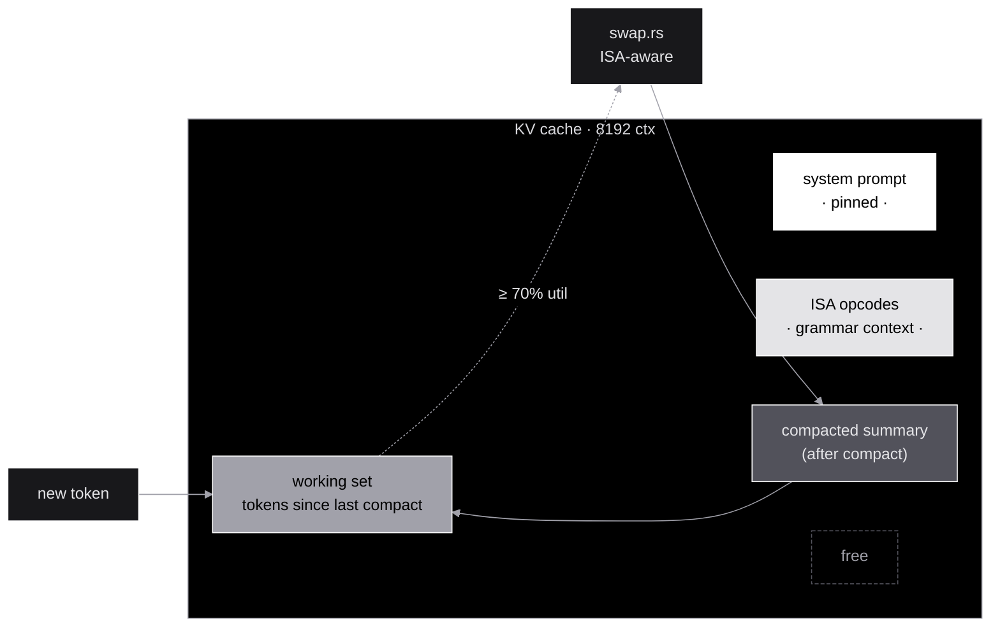
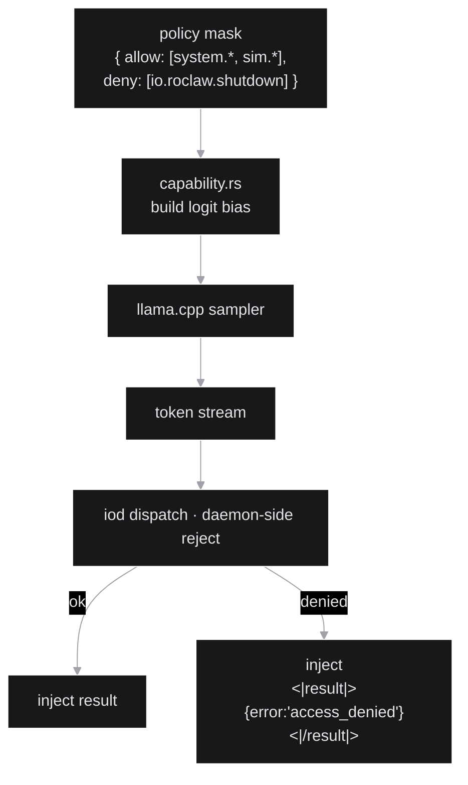

<p align="center">
  
</p>

<p align="center">
  <strong>llm_os</strong> &nbsp;//&nbsp; kernel architecture &nbsp;//&nbsp; <code>v0.5-rc1</code>
</p>

<p align="center">
  
</p>

> Companion to [`README.md`](../README.md) and [`grammar/isa-spec.md`](../grammar/isa-spec.md).
> The README is the *pitch*, the ISA spec is the *contract*, this doc is
> the *map* — every layer, every data path, every safety invariant.

---

## ▸ §1 the OS-as-LLM mapping

The thesis: `llm_os` is not "an agent that uses an LLM". It is an OS
where the LLM itself plays the role of the CPU. Every primitive of a
classical OS has a corresponding primitive in this stack:

```mermaid
%%{init: {'theme':'base', 'themeVariables': {'primaryColor':'#18181b','primaryTextColor':'#e4e4e7','primaryBorderColor':'#ffffff','lineColor':'#a1a1aa','secondaryColor':'#27272a','tertiaryColor':'#000','background':'#000','mainBkg':'#18181b','clusterBkg':'#000','clusterBorder':'#a1a1aa','edgeLabelBackground':'#000','fontFamily':'ui-monospace, monospace'}}}%%
flowchart LR
    subgraph POSIX["POSIX side"]
        CPU[CPU instruction set]
        RAM[RAM]
        MMU[MMU / type safety]
        Swap[Swap]
        Ring[Ring 0 / Ring 3]
        SC[Syscall interface]
        Proc[/proc · /sys]
        Mod[Kernel module]
    end
    subgraph LLM_OS["llm_os side"]
        ISA["13-opcode ISA<br/>(GBNF tokens)"]
        KV[KV cache]
        GBNF[GBNF grammar<br/>sampler-enforced]
        Compact[KV compaction<br/>ISA-aware]
        LB[Logit bias mask]
        CALL["&lt;|call|&gt; opcode<br/>+ schema"]
        Trace[/trace · /policy<br/>iod endpoints]
        Cart["Cartridge<br/>manifest + schemas + handler"]
    end
    CPU -.-> ISA
    RAM -.-> KV
    MMU -.-> GBNF
    Swap -.-> Compact
    Ring -.-> LB
    SC -.-> CALL
    Proc -.-> Trace
    Mod -.-> Cart
```

The strongest claim: GBNF is not "a constraint we apply afterward",
it's the **type system enforced by the sampler at decode time**. Wrong
sequences are physically impossible to emit. Prompt engineering moves
to the compiler level.

<p align="center">
  
</p>

## ▸ §2 the ring model



| Ring | Latency budget | Determinism | Purpose |
|---|---|---|---|
| **R3** · userland | ms (cartridge-side) | mixed (handler-defined) | syscall implementations |
| **R2** · iod kernel | sub-ms | hard | dispatch · schedule |
| **R1** · ISA | sampler step | **hard** (grammar) | every emitted token validated |
| **R0** · KV | constant per token | hard | working memory |
| **HW** · CPU | weights @ ~120 ms/token on Pi 5 | n/a | the LLM itself |

The deeper the ring, the harder the determinism. R1 is the sampler-
level guarantee that the LLM cannot emit a malformed instruction
sequence.

<p align="center">
  
</p>

## ▸ §3 the dispatch loop

```mermaid
%%{init: {'theme':'base', 'themeVariables': {'primaryColor':'#18181b','primaryTextColor':'#e4e4e7','primaryBorderColor':'#ffffff','lineColor':'#a1a1aa','secondaryColor':'#27272a','background':'#000','mainBkg':'#18181b','actorBkg':'#18181b','actorBorder':'#ffffff','actorTextColor':'#e4e4e7','signalColor':'#a1a1aa','signalTextColor':'#e4e4e7','noteBkgColor':'#27272a','noteTextColor':'#bff7ff','noteBorderColor':'#00d4ff','activationBkgColor':'#ffffff','sequenceNumberColor':'#000','fontFamily':'ui-monospace, monospace'}}}%%
sequenceDiagram
    participant User
    participant Iod as iod (/dispatch)
    participant Llama as llama.cpp
    participant Parser as parser.rs
    participant Cap as capability.rs
    participant Cart as cartridge handler
    participant KV as KV cache

    User->>Iod: POST /dispatch {goal}
    Iod->>Cap: load policy mask
    Iod->>Llama: prompt + grammar=isa.gbnf
    loop sampler step (8 Hz on Pi 5)
        Llama->>Llama: sample next token (GBNF + bias)
        Llama-->>Parser: token
        Parser->>Parser: assemble Op event
        alt Op == &lt;|call|&gt;
            Parser->>Iod: call(cart.method, args)
            Iod->>Iod: schema validate
            Iod->>Cart: invoke handler
            Cart-->>Iod: result json
            Iod->>Llama: inject &lt;|result|&gt;…&lt;|/result|&gt;
        else Op == &lt;|halt|&gt;
            Parser->>Iod: program end
        else Op == &lt;|yield|&gt;
            Parser->>Iod: scheduler swap point
        end
        Llama->>KV: append tokens
        Note over KV: util ≥ 70% ⇒ compact
    end
    Iod-->>User: trace + final state
```

Three things to notice:
- **The grammar is the contract.** Every token Llama can emit is
  syntactically legal — invalid ISA sequences are decode-rejected.
- **The result block is predicted by the grammar.** The sampler knows
  shape `<|result|>…<|/result|>` will appear next; the daemon
  injects, the sampler resumes. Neither side is trusted alone.
- **Compaction may run mid-dispatch.** This is where state corruption
  lurks if not handled carefully — see §5 and
  [`NEXT_STEPS.md §2`](NEXT_STEPS.md).

<p align="center">
  
</p>

## ▸ §4 cartridge anatomy



A concrete example — the `system.summarize` cartridge:

```
cart/system/summarize/
├── manifest.json                # name="system.summarize", methods=[run], preferred_tier="local"
├── schemas/
│   └── run.args.schema.json     # { path: string, max_chars?: int }
├── dialect.gbnf                 # optional · adds "S <path>" shorthand
└── (handler is in runtime/handlers.rs for v0.5; per-cart .wasm in v1.0)
```

When the LLM emits `<|call|>system.summarize {"path":"./README.md"} <|/call|>`:

1. **Parser** assembles the `Op::Call` event.
2. **Capability** check: is `system.summarize` in the current policy
   mask? (yes by default).
3. **Schema validation**: JSON args validated against
   `schemas/run.args.schema.json`. Mismatch → `<|fault|>` injected.
4. **Handler** runs (Rust function in v0.5).
5. **Result** wrapped in `<|result|>...<|/result|>` and re-injected.
6. **Sampler** resumes. Grammar predicted this exact shape so no
   re-priming is needed.

<p align="center">
  
</p>

## ▸ §5 KV cache · the RAM model



### compaction (= swap)

When KV utilization crosses 70%, [`runtime/swap.rs`](../runtime/swap.rs)
asks the model to summarize the older portion of the working set,
replaces those tokens with the summary, and reinjects.

**The danger:** if the compactor drops a token sequence that includes
an unclosed `<|loop|>` or a pending `<|result|>` expectation, the
GBNF grammar will reject the next emission as malformed. The current
v0.5 implementation does not yet track this state — it's the
[`NEXT_STEPS.md §2`](NEXT_STEPS.md) work.

### v1.0 ISA-aware compactor (planned)

The compactor will preserve:
- exact current loop depth (the grammar's stack pointer)
- pending `<|result|>` / `<|ack|>` expectations
- in-flight subagent fork ids

before dropping any tokens. The summary that replaces older tokens is
prepended with explicit state markers so the sampler resumes coherently.

<p align="center">
  
</p>

## ▸ §6 capability · the ring model in practice



Two layers of enforcement, intentionally redundant:

1. **Logit bias** at the sampler — sets banned-opcode logits to −∞ so
   the model never tokenizes them.
2. **Daemon-side reject** — even if the bias is bypassed (multi-token
   merging, bootstrap models with weak token boundaries), the `iod`
   parser catches forbidden ops and synthesizes an `access_denied`
   result.

The redundancy matters because GBNF / logit bias is brittle on
bootstrap models with imperfect tokenizers. We trust the daemon-side
reject as the hard fence; the bias is a soft optimization. See
[`NEXT_STEPS.md §5`](NEXT_STEPS.md).

**Status (v0.5):** [`capability.rs`](../runtime/capability.rs) is now
**implemented**. It queries `/tokenize` for opcode token IDs and builds
a `logit_bias` array banning unauthorized opcodes, preferring unique
constituent tokens to minimize false positives on bootstrap kernels.
On fine-tuned kernels (post-v0.1) where each opcode is a single token,
the bias is exact. The daemon-side reject remains the hard fence.

<p align="center">
  
</p>

## ▸ §7 dialect · token economy as cycle optimization

At 8 Hz on a Pi 5, every token saved is a cycle saved. The dialect
layer compresses the wire format of high-frequency calls without
losing semantics:

```
verbose                     dialect              tokens saved
─────────                   ─────────            ──────────
{"left":150,"right":150}    F 150 150            7×
{"angle":45,"speed":80}     R 45 80              6×
{"action":"stop"}           S                    9×
```

Each cartridge can declare a `dialect.gbnf` adding shorthand syntax
that maps to its full JSON schema. The grammar accepts both forms;
the parser canonicalizes before schema validation.

<p align="center">
  
</p>

## ▸ §8 dual-brain routing

```mermaid
%%{init: {'theme':'base', 'themeVariables': {'primaryColor':'#18181b','primaryTextColor':'#e4e4e7','primaryBorderColor':'#ffffff','lineColor':'#a1a1aa','secondaryColor':'#27272a','background':'#000','mainBkg':'#18181b','clusterBkg':'#000','clusterBorder':'#a1a1aa','edgeLabelBackground':'#000','fontFamily':'ui-monospace, monospace'}}}%%
flowchart LR
    Goal[/dispatch] --> Iod[iod]
    Iod --> Manifest{cart.preferred_tier?}
    Manifest -- "local" --> Local[llama.cpp · Pi 5]
    Manifest -- "cloud" --> Sub[subagent.rs]
    Sub --> Cloud[Gemini 2.5 Flash · cloud]
    Local --> Result1[result]
    Cloud --> Result2[result]
    Result1 --> Iod
    Result2 --> Iod
```

Each cartridge declares `preferred_tier: "local" | "cloud"` in its
manifest. The subagent path uses the same ISA — the cloud worker
emits identical opcodes; only the sampler is remote. This means a
goal that needs heavier planning (e.g. multi-step reasoning over a
large knowledge base) escalates without a separate code path. See
[`runtime/cloud.rs`](../runtime/cloud.rs) and
[`runtime/subagent.rs`](../runtime/subagent.rs).

**Status (v0.5):** Subagent cartridges are **real**. The `Subagent`
trait in [`subagent.rs`](../runtime/subagent.rs) defines the
`LLMProxy`/`CloudProxy` interface. `cart/system/summarize/` is the
reference subagent — when the LLM emits
`<|call|>summarize.summarize`, the daemon detects `subagent: true`
on the manifest and routes through the injected proxy. Cloud creds
from `LLM_OS_CLOUD_*` env vars. Dynamic WASM-sandboxed subagent
loading is a v1.0 goal.

<p align="center">
  
</p>

## ▸ §9 cross-cutting invariants

The five non-negotiables, encoded in tests:

1. **Grammar invariants** (sampler-enforced). `<|halt|>` only at depth 0,
   every `<|loop|>` matched, every `<|read|>`/`<|call|>`/`<|wait|>`/
   `<|fault|>`/`<|policy|>` followed by a `<|result|>` block. See
   [`grammar/tests/`](../grammar/tests/).
2. **Schema validation before handler.** No cartridge handler runs on
   unvalidated args. Period.
3. **Result injection is grammar-predicted.** The sampler doesn't
   re-prime; it expects the result shape and resumes mid-stream.
4. **Capability is checked twice** (logit bias + daemon-side reject).
5. **Cartridge handlers are pure** with respect to KV state. Side
   effects go through declared schemas; no out-of-band mutation.

<p align="center">
  
</p>

## ▸ §10 file map

```
runtime/
├── bootloader.c            ← C bootstrap; fork llama-server, inject boot prompt
├── lib.rs                  ← library root
├── iod_main.rs             ← daemon entry point (CLI: --server --grammar --trace)
├── iod.rs                  ← /dispatch /trace /policy + stop-and-inject loop
├── parser.rs               ← token stream → Op events (14 opcodes incl. <|state|>)
├── dispatch.rs             ← Op::Call → handler routing + schema validation
├── handlers.rs             ← real cartridge implementations (cooking, electrical, demo)
├── cartridge.rs            ← manifest + schema loading + CartridgeRegistry
├── capability.rs           ← logit bias via /tokenize + daemon-side reject (v0.5)
├── dialect.rs              ← per-cart dialect compression (3 built-in dialects)
├── scheduler.rs            ← wall+token budgets, soft/hard preemption (v0.5)
├── multitask.rs            ← thread-per-task pool via llama-server id_slot (v0.5)
├── swap.rs                 ← KV compaction at 70% (ISA-aware planned for v1.0)
├── subagent.rs             ← Subagent trait + LLMProxy + CloudProxy (v0.5)
├── cloud.rs                ← OpenAI-compatible HTTP client
├── roclaw.rs               ← roclaw cartridge: args → 6-byte UDP frames
├── tool_parser.rs          ← fallback call parser (5 shapes + JSON repair)
├── schema_to_gbnf.rs       ← JSON Schema → GBNF compiler (v0.1)
├── compile_schemas_main.rs ← build-time schema compilation binary
├── mock_server.rs          ← test-only mock llama-server
└── tests/                  ← rust integration tests

grammar/
├── isa.gbnf                ← the 13-opcode ISA (GBNF, sampler-enforced)
├── isa-spec.md             ← semantics + invariants + examples
└── tests/
    ├── legal/              ← 6 fixtures that must parse
    └── illegal/            ← 6 fixtures that must NOT parse

cart/
├── system/{summarize,demo}/          ← summarize is a subagent (v0.5)
├── io/roclaw/                        ← real handler: 13 motor methods → UDP
├── sim/sim_world/                    ← real handler: 4×1 grid for e2e tests
└── domestic/{cooking,residential-electrical}/  ← real handlers (v0.1)

scripts/
├── quickstart.sh           ← cold checkout → first task (≤10 min on Pi 5)
├── validate_grammar.sh     ← 12/12 grammar fixture validator
├── check_tokenizer.sh      ← tokenization parity analysis
├── rebuild_tokenizer.py    ← add 18 ISA tokens as single tokens
├── promote_traces.py       ← JSONL traces → DPO triples (self-hosting, v0.5)
└── dev.sh                  ← development build shortcuts

image/
├── build.sh                ← Buildroot Pi 5 bootable image
├── flash.sh                ← flash to SD card
├── buildroot_defconfig     ← kernel + rootfs config
└── overlay/                ← runtime + cart + model in rootfs
```

<p align="center">
  
</p>

## ▸ §11 recent changes (v0.1 → v0.5-rc1)

Shipped in `v0.1-rc1` and `v0.5-rc1` (both 2026-04-25):

- **Real cartridge handlers (v0.1).** `cooking`, `residential-electrical`,
  and `demo` cartridges have real Rust implementations in `handlers.rs`.
  Cooking emits 7-day menus + shopping lists. Electrical does IEC-60364
  circuit sizing. Demo does hash + echo.
- **Per-method GBNF compilation (v0.1).** `schema_to_gbnf.rs` compiles
  JSON Schema to GBNF sub-grammars. `compile_schemas` binary
  materializes them on disk. Mid-stream swap deferred to v1.0; v0.5
  surfaces them in schema-violation error messages.
- **Dialect framework (v0.1).** `dialect.rs` with 3 built-in dialects:
  `roclaw-motion-v1`, `roclaw-rotate-v1`, `sim-world-step-v1`.
  `F 150 150` → `{"left":150,"right":150}` — 2× token compression.
- **Scheduler (v0.5).** `scheduler.rs` with unified wall + token
  budgets. Soft preempt at 80% (logged), hard preempt force-injects
  `<|halt|>status=partial`.
- **Multi-task (v0.5).** `multitask.rs` spawns N worker threads
  against one llama-server using `id_slot` for KV-cache isolation.
  Start server with `--parallel N`.
- **Capability enforcement (v0.5).** `capability.rs` queries
  `/tokenize` for opcode token IDs, builds `logit_bias` banning
  unauthorized opcodes. Prefers unique constituent tokens. See §6.
- **Subagent cartridges (v0.5).** `subagent.rs` defines the
  `Subagent` trait. `cart/system/summarize/` is the reference
  subagent routed through an injected `CloudProxy`. See §8.
- **Self-hosting trace pipeline (v0.5).** `promote_traces.py`
  reads JSONL traces, filters successful trajectories, dedupes, emits
  DPO triples. The *Linux 0.11 moment*: the OS curates its own
  training data.
- **Trace collection (v0.1).** `iod --trace <path>` appends one JSONL
  line per task (goal, prompt, stream, status, step count, carts used).
- **Fine-tune recipe (v0.1).** `rebuild_tokenizer.py` + detailed
  recipe in `docs/fine-tune-recipe.md` for DPO with LoRA on the
  ISA token corpus.
- **Projection re-baseline (v0.1).** `docs/projection-rebaseline-2026-04-25.md`
  benchmarked per-syscall token costs and throughput projections.

## ▸ §12 next steps · v1.0 roadmap

Six items stand between v0.5-rc1 and production-ready v1.0.
Full details in [`NEXT_STEPS.md`](NEXT_STEPS.md).

### priority order

| # | Area | Problem | Fix | Crux |
|---|------|---------|-----|------|
| §1 | **Grammar** | 3 HTTP requests per syscall for grammar swap | Multi-grammar stack in llama.cpp sampler | User-facing perf (8 Hz target on Pi 5) |
| §2 | **Compact** | KV compaction drops unclosed `<\|loop\|>` / pending `<\|result\|>` state | ISA-aware compactor + `<\|state\|>` opcode (14th) | Tightest technical crux — silent state corruption |
| §3 | **Recover** | Schema violations burn context in retry loops | Three-strikes rule + cloud escalation with violation history | 30s → ≤6s resolution |
| §4 | **Sandbox** | Cartridge handlers run in-process (no real Ring 3) | WASM via `wasmtime` with curated host function table | Security: real ring boundary |
| §5 | **Caps** | Logit bias brittle on multi-token bootstrap models | Daemon-side `enforce_runtime` as hard fence, bias downgraded to hint | Belt + suspenders |
| §6 | **Tokens** | Bootstrap opcodes are 1–5 tokens depending on BPE | Single-token fine-tune: 18 ISA tokens added to tokenizer | Uniform latency + reliable bias |

### the two cruxes

**§1 (grammar swap)** is the user-facing performance crux. The current
per-method GBNF design requires ~200–400 ms overhead per syscall. A
patched llama.cpp sampler with a multi-grammar stack eliminates this
by switching sub-grammars in-process when `<|call|>` is emitted.
Target: 8 Hz steady across 100 sequential calls on Pi 5.

**§2 (ISA-aware compactor)** is the technical correctness crux. If the
compactor drops tokens containing an unclosed `<|loop|>` or a pending
`<|result|>` expectation, the GBNF state machine rejects the next
emission. The fix: walk the dropped window, extract ISA state
(loop depth, pending results, fork IDs), prepend a synthetic
`<|state|>` preamble to the summary so the sampler resumes coherently.

### explicit non-goals (v1.0 scope)

- Multi-process iod federation (v1.5+)
- Persistent KV across reboots (separate cartridge concern)
- Distributed cartridges over network (RPC-style, different problem)
- Custom kernel-mode model from scratch (post-v1.0 research)

Full analysis: [`docs/NEXT_STEPS.md`](NEXT_STEPS.md).

<p align="center">
  
</p>

<p align="center">
  
</p>

<p align="center">
  <sub><code>// ARCH.MAP // 13 OPCODES · 5 INVARIANTS · 4 RINGS · V1.0 ROADMAP</code></sub>
</p>
