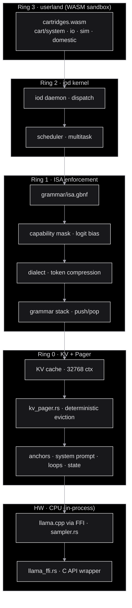
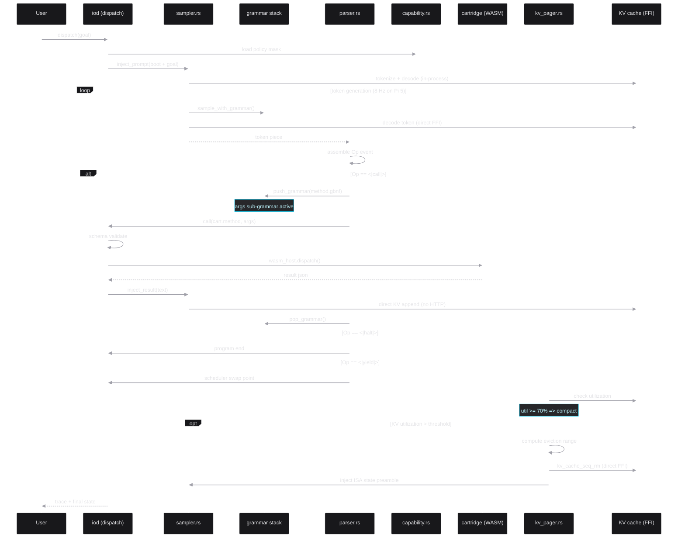
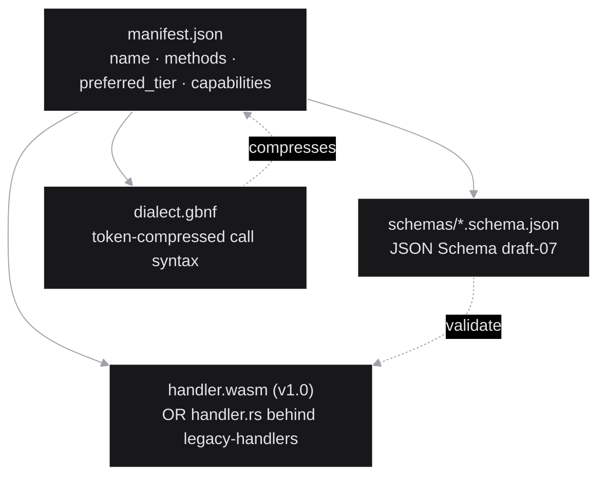
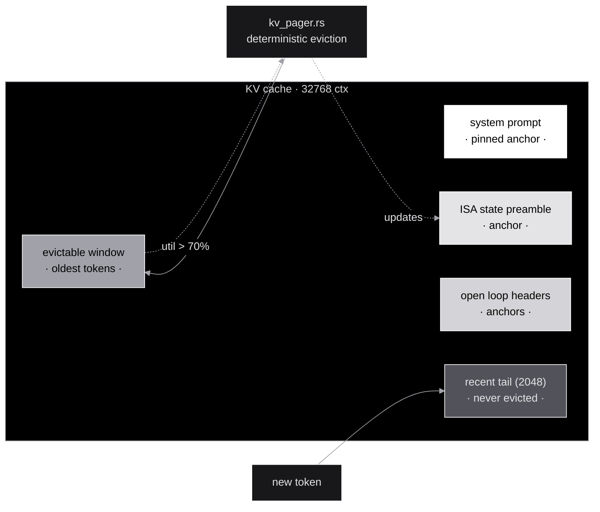
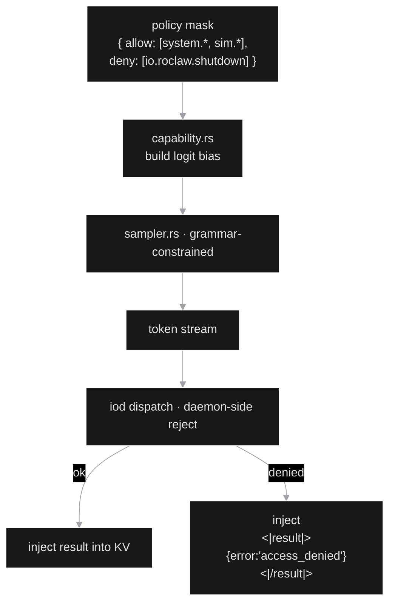
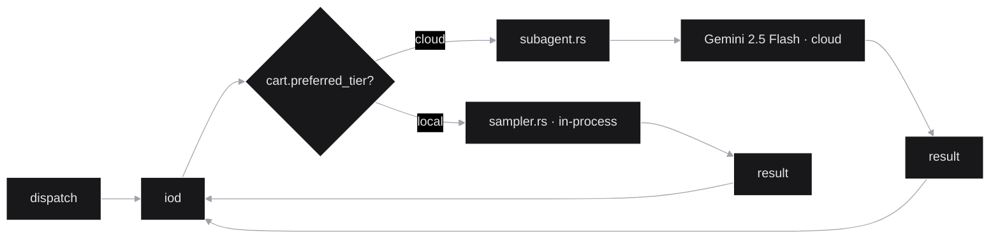

# Architecture

> Companion to [`README.md`](../README.md) and [`grammar/isa-spec.md`](../grammar/isa-spec.md).
> The README is the *pitch*, the ISA spec is the *contract*, this doc is
> the *map* — every layer, every data path, every safety invariant.

---

## The OS-as-LLM mapping

The thesis: `llm_os` is not "an agent that uses an LLM". It is an OS
where the LLM itself plays the role of the CPU. Every primitive of a
classical OS has a corresponding primitive in this stack:

```mermaid
%%{init: {'theme':'base', 'themeVariables': {'primaryColor':'#18181b','primaryTextColor':'#e4e4e7','primaryBorderColor':'#ffffff','lineColor':'#a1a1aa','secondaryColor':'#27272a','tertiaryColor':'#000','background':'#000','mainBkg':'#18181b','clusterBkg':'#000','clusterBorder':'#a1a1aa','edgeLabelBackground':'#000','fontFamily':'ui-monospace, monospace'}}}%%
flowchart LR
    subgraph POSIX["POSIX side"]
        CPU[CPU instruction set]
        RAM[RAM]
        MMU[MMU / type safety]
        Swap[Swap / paging]
        Ring[Ring 0 / Ring 3]
        SC[Syscall interface]
        Proc[/proc · /sys]
        Mod[Kernel module]
        VM[Virtual memory]
    end
    subgraph LLM_OS["llm_os side"]
        ISA["14-opcode ISA<br/>(GBNF tokens)"]
        KV[KV cache]
        GBNF[GBNF grammar<br/>sampler-enforced]
        Pager[Deterministic KV pager<br/>anchors + eviction]
        WASM[WASM sandbox<br/>+ logit bias]
        CALL["&lt;|call|&gt; opcode<br/>+ schema"]
        Trace[/trace · /policy<br/>iod endpoints]
        Cart["Cartridge<br/>manifest + schemas + handler.wasm"]
        GStack[Grammar stack<br/>push/pop sub-grammars]
    end
    CPU -.-> ISA
    RAM -.-> KV
    MMU -.-> GBNF
    Swap -.-> Pager
    Ring -.-> WASM
    SC -.-> CALL
    Proc -.-> Trace
    Mod -.-> Cart
    VM -.-> GStack
```

The strongest claim: GBNF is not "a constraint we apply afterward",
it's the **type system enforced by the sampler at decode time**. Wrong
sequences are physically impossible to emit. Prompt engineering moves
to the compiler level.

## The ring model



| Ring | Latency budget | Determinism | Purpose |
|---|---|---|---|
| **R3** · userland | ms (cartridge-side) | mixed (handler-defined) | WASM-sandboxed syscall implementations |
| **R2** · iod kernel | sub-ms | hard | dispatch · schedule |
| **R1** · ISA | sampler step | **hard** (grammar) | every emitted token validated |
| **R0** · KV + Pager | constant per token | hard | working memory + deterministic eviction |
| **HW** · CPU (FFI) | weights @ ~120 ms/token on Pi 5 | n/a | the LLM itself (in-process via FFI) |

The deeper the ring, the harder the determinism. R1 is the sampler-
level guarantee that the LLM cannot emit a malformed instruction
sequence.

## The dispatch loop (v1.0 — in-process)



Key differences from v0.5:

1. **No HTTP boundary.** The sampler drives llama.cpp's decode loop
   directly via FFI. Stop-and-inject costs < 1 ms instead of 200-400 ms.
2. **Grammar stack.** On `<|call|>`, push the method's args sub-grammar.
   On `<|/call|>`, pop back to ISA grammar. Zero-cost grammar switching.
3. **Deterministic paging.** KV compaction uses positional token eviction
   with anchors — no LLM summarization, fully deterministic, < 5 ms.
4. **WASM dispatch.** Cartridges run in wasmtime sandbox with curated
   host functions. Real Ring 3 isolation.

## In-process inference (Phase 1)

The HTTP boundary between `iod` and `llama-server` is collapsed into a
single binary via FFI:

```
Before (v0.5):
  bootloader.c → fork llama-server (HTTP/SSE) ← iod.rs (HTTP client)
  Overhead: 200-400 ms per stop-and-inject cycle

After (v1.0):
  iod (llama_ffi.rs → sampler.rs → direct KV manipulation)
  Overhead: < 1 ms per stop-and-inject cycle
```

### Module: `runtime/llama_ffi.rs`

Thin FFI wrapper over llama.cpp's C API. Safe Rust types:

- `LlamaModel` — model loading, tokenization, vocabulary access
- `LlamaContext` — KV cache, decode, token generation

Feature-gated: `#[cfg(feature = "ffi-inference")]` for real FFI,
stub implementations when disabled (graceful degradation to legacy mode).

### Module: `runtime/sampler.rs`

In-process token generation replacing the HTTP SSE loop:

- `Sampler::generate_segment()` — emit tokens until opcode boundary
- `Sampler::inject_result()` — append result tokens to KV (no HTTP)
- `Sampler::inject_prompt()` — initial boot prompt
- Grammar stack: `push_grammar()` / `pop_grammar()` for mid-stream swap

Stop markers detect opcode boundaries:
```rust
const STOP_MARKERS: &[&str] = &[
    "<|/call|>", "<|read|>", "<|write|>", "<|wait|>",
    "<|fault|>", "<|policy|>", "<|halt|>",
];
```

## Deterministic KV paging (Phase 2)

Replaces the LLM-summarization compactor with positional token eviction:

### Module: `runtime/kv_pager.rs`

```
┌─────────────────────────────────────────────────────────────────┐
│ KV Cache Layout (token positions)                                │
│                                                                  │
│ [SYSTEM PROMPT | ANCHORS... | EVICTABLE WINDOW | RECENT TAIL]    │
│  ^never evict   ^protected   ^evict oldest     ^never evict     │
│                                                                  │
│ Anchors: ISA state preamble, open loop goals, cartridge schemas  │
│ Recent tail: last N tokens (configurable, default 2048)          │
│ Evictable: everything between anchors and tail                   │
└─────────────────────────────────────────────────────────────────┘
```

**Algorithm** (fully deterministic, no LLM involvement):

1. When KV utilization > threshold (default 70%):
2. Identify **anchor positions** (system prompt, `<|state|>` preamble,
   active loop headers)
3. Identify **recent tail** (last N tokens — always preserved)
4. Compute **eviction window** (between anchors and tail)
5. Evict oldest portion via `llama_kv_cache_seq_rm()` (direct FFI)
6. Optionally inject ISA state preamble from `swap::IsaState`

**Properties:**
- Deterministic: same input → same eviction decisions
- Fast: < 5 ms (vs LLM-summary: 200+ ms)
- ISA-aware: preserves loop state, pending results, fork IDs via anchors
- Configurable: threshold, tail size, eviction ratio

## WASM cartridge sandbox (Phase 3)

### Module: `runtime/wasm_host.rs`

True Ring 3 isolation via wasmtime:

```
┌─────────────────────────────────────────────────────────┐
│ iod (Ring 0-2)                                           │
│   ├── dispatch.rs (routes call → WASM instance)          │
│   └── wasm_host.rs (WasmEngine + host functions)         │
│                                                          │
│   ┌─────────────────────────────────────────────┐        │
│   │ wasmtime (sandboxed execution)              │        │
│   │   cartridge.wasm                             │        │
│   │     exports: dispatch(method, args) → result │        │
│   │     imports: host_log, host_clock, host_kv   │        │
│   └─────────────────────────────────────────────┘        │
└─────────────────────────────────────────────────────────┘
```

### Host functions provided to cartridges

| Function | Purpose | Capability gate |
|---|---|---|
| `host_log(level, msg_ptr, msg_len)` | Structured logging | always |
| `host_clock_ms() -> i64` | Monotonic clock | always |
| `host_kv_get(key_ptr, key_len, buf_ptr, buf_len) -> i32` | Per-cart KV read | `kv_store` |
| `host_kv_set(key_ptr, key_len, val_ptr, val_len)` | Per-cart KV write | `kv_store` |
| `host_kv_del(key_ptr, key_len) -> i32` | Per-cart KV delete | `kv_store` |
| `host_http_get(url_ptr, url_len, buf_ptr, buf_len) -> i32` | Gated HTTP | `network_outbound` |

No raw filesystem, no process spawning, no environment access.

### Cartridge capabilities

```rust
pub struct CartridgeCaps {
    pub network_outbound: bool,   // Can make outbound HTTP
    pub kv_store: bool,           // Can access per-cart KV store
    pub max_memory_pages: u32,    // WASM memory limit (64KB/page)
    pub max_exec_ms: u64,         // Execution timeout
}
```

### Transition strategy

In-process handlers (`runtime/handlers.rs`) stay behind the
`legacy-handlers` feature flag. WASM cartridges are loaded from
`cart/<domain>/<name>/handler.wasm`. Both paths coexist during
migration.

## Cartridge anatomy



A concrete example — the `system.summarize` cartridge:

```
cart/system/summarize/
├── manifest.json                # name="system.summarize", methods=[run], preferred_tier="local"
├── schemas/
│   └── run.args.schema.json     # { path: string, max_chars?: int }
├── dialect.gbnf                 # optional · adds "S <path>" shorthand
└── handler.wasm                 # compiled from Rust (wasm32-wasip2)
```

When the LLM emits `<|call|>system.summarize {"path":"./README.md"} <|/call|>`:

1. **Parser** assembles the `Op::Call` event.
2. **Grammar stack** pops back to ISA grammar after `<|/call|>`.
3. **Capability** check: is `system.summarize` in the current policy
   mask? (yes by default).
4. **Schema validation**: JSON args validated against
   `schemas/run.args.schema.json`. Mismatch → `<|fault|>` injected.
5. **WASM dispatch**: `wasm_host.dispatch("summarize", "run", args)`.
6. **Result** wrapped in `<|result|>...<|/result|>` and injected
   directly into KV cache via `sampler.inject_result()`.
7. **Sampler** resumes. Grammar predicted this exact shape so no
   re-priming is needed.

## KV cache · the RAM model



### Compaction (v1.0 — deterministic paging)

When KV utilization crosses the threshold, `kv_pager.rs` executes
deterministic positional eviction:

1. **Anchor identification**: system prompt, `<|state|>` preamble,
   open loop headers are never evicted.
2. **Tail preservation**: last N tokens (default 2048) always kept.
3. **Eviction**: oldest tokens in the evictable window are removed
   via `llama_kv_cache_seq_rm()` (direct FFI call, < 1 ms).
4. **State injection**: if ISA state is non-trivial, the pager injects
   a `<|state|>` preamble so the sampler resumes coherently.

**No LLM involvement.** No summarization. Fully deterministic.

The `swap.rs` module still provides `IsaState` extraction (loop depth,
pending results, fork IDs) which the pager uses for state preamble
generation.

## Capability · the ring model in practice



Two layers of enforcement, intentionally redundant:

1. **Logit bias** at the sampler — sets banned-opcode logits to -inf so
   the model never tokenizes them. With single-token ISA (Phase 4),
   this is **exact** (one token = one opcode = perfect banning).
2. **Daemon-side reject** — even if the bias is bypassed (multi-token
   merging on bootstrap models), the `iod` parser catches forbidden
   ops and synthesizes an `access_denied` result.

The redundancy matters because GBNF / logit bias is brittle on
bootstrap models with imperfect tokenizers. The fine-tuned kernel
(single-token ISA) makes the bias exact; the daemon-side reject
remains the hard fence for defense in depth.

## Dialect · token economy as cycle optimization

At 8 Hz on a Pi 5, every token saved is a cycle saved. The dialect
layer compresses the wire format of high-frequency calls without
losing semantics:

```
verbose                     dialect              tokens saved
─────────                   ─────────            ──────────
{"left":150,"right":150}    F 150 150            7x
{"angle":45,"speed":80}     R 45 80              6x
{"action":"stop"}           S                    9x
```

Each cartridge can declare a `dialect.gbnf` adding shorthand syntax
that maps to its full JSON schema. The grammar accepts both forms;
the parser canonicalizes before schema validation.

## Dual-brain routing



Each cartridge declares `preferred_tier: "local" | "cloud"` in its
manifest. The subagent path uses the same ISA — the cloud worker
emits identical opcodes; only the sampler is remote. This means a
goal that needs heavier planning escalates without a separate code path.

## Single-token ISA (Phase 4)

The fine-tune pipeline ensures all 20 ISA tokens are single-token:

```python
SINGLE_TOKENS = [
    "<|read|>",    "<|write|>",   "<|call|>",    "<|/call|>",
    "<|yield|>",   "<|fork|>",    "<|wait|>",    "<|loop|>",
    "<|break|>",   "<|halt|>",    "<|think|>",   "<|/think|>",
    "<|commit|>",  "<|fault|>",   "<|policy|>",  "<|state|>",
    "<|/state|>",  "<|result|>",  "<|/result|>", "<|ack|>",
]
```

Pipeline (`scripts/rebuild_tokenizer.py`):
1. `patch` — add tokens as special tokens, resize embeddings
2. `validate` — verify all are single-token
3. `finetune` — LoRA DPO on promoted traces
4. `export` — convert to GGUF with quantization

Benefits:
- Uniform latency (1 token per opcode regardless of model)
- Exact capability enforcement (one logit to ban = perfect)
- Reliable grammar switching (single-token boundaries)

## Cross-cutting invariants

The five non-negotiables, encoded in tests:

1. **Grammar invariants** (sampler-enforced). `<|halt|>` only at depth 0,
   every `<|loop|>` matched, every `<|read|>`/`<|call|>`/`<|wait|>`/
   `<|fault|>`/`<|policy|>` followed by a `<|result|>` block. See
   [`grammar/tests/`](../grammar/tests/).
2. **Schema validation before handler.** No cartridge handler runs on
   unvalidated args. Period.
3. **Result injection is grammar-predicted.** The sampler doesn't
   re-prime; it expects the result shape and resumes mid-stream.
4. **Capability is checked twice** (logit bias + daemon-side reject).
5. **Cartridge handlers are sandboxed** (WASM) with respect to KV state.
   Side effects go through declared schemas and curated host functions;
   no out-of-band mutation.

## File map

```
runtime/
├── lib.rs                  ← library root (all modules registered)
├── iod_main.rs             ← daemon entry point (CLI: --model --grammar --trace)
├── iod.rs                  ← /dispatch /trace /policy + stop-and-inject loop
│
├── llama_ffi.rs            ← [Phase 1] Thin FFI wrapper over llama.cpp C API
├── sampler.rs              ← [Phase 1] In-process token generation + grammar stack
│
├── kv_pager.rs             ← [Phase 2] Deterministic KV paging with anchors
├── swap.rs                 ← ISA-aware state extraction (IsaState) used by pager
│
├── wasm_host.rs            ← [Phase 3] wasmtime sandbox + host functions + caps
│
├── parser.rs               ← token stream → Op events (14 opcodes incl. <|state|>)
├── dispatch.rs             ← Op::Call → handler routing + schema validation
├── handlers.rs             ← in-process Rust handlers (legacy, behind feature flag)
├── cartridge.rs            ← manifest + schema loading + CartridgeRegistry
├── capability.rs           ← logit bias via tokenize + daemon-side reject
├── dialect.rs              ← per-cart dialect compression (3 built-in dialects)
├── scheduler.rs            ← wall+token budgets, soft/hard preemption
├── multitask.rs            ← thread-per-task pool via KV slot isolation
├── subagent.rs             ← Subagent trait + LLMProxy + CloudProxy
├── cloud.rs                ← OpenAI-compatible HTTP client (cloud fallback)
├── roclaw.rs               ← roclaw cartridge: args → 6-byte UDP frames
├── tool_parser.rs          ← fallback call parser (5 shapes + JSON repair)
├── schema_to_gbnf.rs       ← JSON Schema → GBNF compiler
├── compile_schemas_main.rs ← build-time schema compilation binary
├── mock_server.rs          ← test-only mock llama-server (legacy mode)
└── Cargo.toml              ← v1.0.0 with feature flags

grammar/
├── isa.gbnf                ← the 14-opcode ISA (GBNF, sampler-enforced)
├── isa-spec.md             ← semantics + invariants + examples
└── tests/
    ├── legal/              ← 6 fixtures that must parse
    └── illegal/            ← 6 fixtures that must NOT parse

cart/
├── system/{summarize,demo}/          ← summarize is a subagent
├── io/roclaw/                        ← hardware: 13 motor methods → UDP
├── sim/sim_world/                    ← simulation: 4x1 grid for e2e tests
└── domestic/{cooking,residential-electrical}/  ← domain cartridges

scripts/
├── quickstart.sh           ← cold checkout → first task
├── validate_grammar.sh     ← 12/12 grammar fixture validator
├── check_tokenizer.sh      ← tokenization analysis + --model validation mode
├── rebuild_tokenizer.py    ← [Phase 4] full ISA fine-tune pipeline
├── promote_traces.py       ← JSONL traces → DPO triples (self-hosting)
└── dev.sh                  ← development build shortcuts

image/
├── build.sh                ← Buildroot Pi 5 bootable image
├── flash.sh                ← flash to SD card
├── buildroot_defconfig     ← kernel + rootfs config (bcm2712/aarch64)
├── genimage.cfg            ← 3-partition layout
└── overlay/                ← runtime + cart + model in rootfs
    └── init                ← PID 1 (watchdog + UART + iod)
```

## Version history

### v1.0 (current)

- **In-process inference** (Phase 1): FFI to llama.cpp eliminates HTTP boundary.
  `llama_ffi.rs` + `sampler.rs` drive the decode loop directly.
- **Deterministic KV paging** (Phase 2): `kv_pager.rs` replaces LLM-summary
  compaction with positional token eviction + anchors.
- **WASM cartridge sandbox** (Phase 3): `wasm_host.rs` provides wasmtime-based
  isolation with curated host functions and capability enforcement.
- **Single-token ISA** (Phase 4): `rebuild_tokenizer.py` pipeline adds 20 ISA
  tokens as single-token, enabling exact capability enforcement.
- **Feature flags**: `ffi-inference`, `legacy-server`, `wasm-sandbox`,
  `legacy-handlers` for gradual migration.
- **14th opcode**: `<|state|>` / `<|/state|>` for ISA state serialization.
- **102 tests passing** across all modules.

### v0.5-rc1 (2026-04-25)

- Scheduler with unified wall + token budgets.
- Multi-task via llama-server `id_slot` pool.
- Capability enforcement via logit bias.
- Subagent cartridges with CloudProxy.
- Self-hosting trace pipeline (`promote_traces.py`).

### v0.1-rc1 (2026-04-25)

- Real cartridge handlers (cooking, electrical, demo).
- Per-method GBNF compilation.
- Dialect framework with 3 built-in dialects.
- Trace collection (`iod --trace`).
- Fine-tune recipe + tokenizer tooling.

## Explicit non-goals (v1.0 scope)

- Multi-process iod federation (v1.5+)
- Persistent KV across reboots (separate cartridge concern)
- Distributed cartridges over network (RPC-style, different problem)
- Custom kernel-mode model from scratch (post-v1.0 research)
