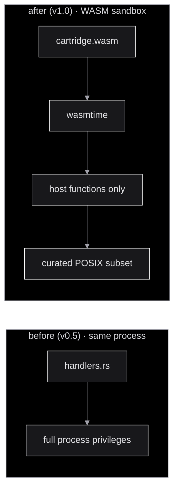

# Roadmap

> Roadmap derived from the April 2026 architecture review. The framing:
> the OS-as-LLM thesis is mechanically sound and validated at v0.5, but
> six concrete things have to land before v1.0 can claim production
> readiness. Each item below is a self-contained PR with clearly
> bounded scope.
>
> Companion docs: [`README.md`](../README.md) · [`ARCHITECTURE.md`](ARCHITECTURE.md) · [`USAGE.md`](USAGE.md) · [`TUTORIAL.md`](TUTORIAL.md).

```
  ┌─[ ROADMAP · v0.5 → v1.0 ]────────────────────────────────────────┐
  │                                                                    │
  │  §1 GRAMMAR  in-llama.cpp grammar swap         · 3 HTTP → 1 hook  │
  │  §2 COMPACT  ISA-aware compactor               · preserve state    │
  │  §3 RECOVER  three-strikes + cloud escalation  · break retry loops │
  │  §4 SANDBOX  WASM cartridge runtime            · real ring 3       │
  │  §5 CAPS     daemon-side opcode reject         · belt + suspenders │
  │  §6 TOKENS   single-token ISA fine-tune        · uniform latency   │
  │                                                                    │
  └────────────────────────────────────────────────────────────────────┘
```

The order reflects priority. **§1 unblocks the 8 Hz target on Pi 5**;
**§2 prevents silent state corruption** which would invalidate every
trace in the archive; the rest harden security and make the runtime
robust to model swaps.

## In-llama.cpp grammar swap · the 1-request fix

> **The problem.** The current per-method GBNF design (see the now-
> archived `grammar-swap-design.md`) requires 3 HTTP requests per
> syscall to swap the active grammar mid-stream:
>
> ```
>   Phase A   POST /completion?grammar=isa.gbnf      → emit <|call|>method
>   Phase B   POST /completion?grammar=method.gbnf   → emit args JSON
>   Phase C   POST /completion?grammar=isa.gbnf      → emit <|/call|>
>   Phase D   POST /completion (no grammar)          → wait for result
> ```
>
> Even with `cache_prompt: true`, the HTTP overhead, network latency,
> and `llama-server` context-matching add ~200–400 ms per syscall.
> That's the entire 8 Hz Pi 5 budget.

### the fix

Push the grammar-swap into `llama.cpp` itself. Custom sampler hook (or
patched `gbnf` parser) that:

1. Reads a JSON-Schema array at session init time (one per cartridge.method).
2. On encountering an opening `<|call|>` token, switches the active
   grammar to the matching method's sub-grammar based on the dotted
   name that follows.
3. On encountering `<|/call|>`, switches back to the top-level ISA.

```mermaid
%%{init: {'theme':'base', 'themeVariables': {'primaryColor':'#18181b','primaryTextColor':'#e4e4e7','primaryBorderColor':'#ffffff','lineColor':'#a1a1aa','secondaryColor':'#27272a','background':'#000','mainBkg':'#18181b','clusterBkg':'#000','clusterBorder':'#a1a1aa','edgeLabelBackground':'#000','fontFamily':'ui-monospace, monospace'}}}%%
flowchart LR
    subgraph Before["before · 3 HTTP per call"]
        B1[POST /completion isa] --> B2[POST /completion method]
        B2 --> B3[POST /completion isa]
        B3 --> B4[POST /completion]
    end
    subgraph After["after · 1 sampler hook"]
        A1[POST /completion isa] --> A2[sampler emits &lt;|call|&gt;]
        A2 --> A3[hook: load method GBNF in-process]
        A3 --> A4[sampler continues · same request]
    end
```

### scope

- A patched `llama.cpp` sampler with a **multi-grammar stack**.
- A new init flag: `--grammar-array <path-to-json>` listing every
  `(opcode_marker, sub_grammar_path)` pair.
- `runtime/iod.rs` ships the array on session init and never swaps
  again — it just reads tokens and dispatches.

### success criteria

- **8 Hz steady on Pi 5 across 100 sequential `<|call|>` ops** with
  `qwen-2.5-3b-q4`.
- `grammar_swap_ms` field in trace dropping from ~200 ms to **< 5 ms**.
- Existing 12/12 grammar fixtures still green.

### timeline

```
  ┌─[ §1 · 3 weeks ]────────────────────────────────────────────────┐
  │                                                                  │
  │  W1   prototype the multi-grammar stack as a llama.cpp patch.   │
  │       Vendored under runtime/llamacpp-patches/.                  │
  │                                                                  │
  │  W2   teach iod to ship a grammar-array on session init.        │
  │       Trace_id includes the grammar version hash.                │
  │                                                                  │
  │  W3   bench loop · 100 sequential calls on Pi 5 hardware.       │
  │       If we hit 8 Hz with grammar_swap_ms < 5, ship as v0.6.    │
  │                                                                  │
  └──────────────────────────────────────────────────────────────────┘
```

## ISA-aware KV compactor · don't drop pending state

> **The problem.** [`runtime/swap.rs`](../runtime/swap.rs) triggers
> compaction at 70% KV utilization. The current implementation
> summarizes older tokens and drops them. If the dropped region
> contains an unclosed `<|loop|>` or a pending `<|result|>`
> expectation, the GBNF state machine has no idea — the next
> compaction-suffix token fails to parse.

```mermaid
%%{init: {'theme':'base', 'themeVariables': {'primaryColor':'#18181b','primaryTextColor':'#e4e4e7','primaryBorderColor':'#ffffff','lineColor':'#a1a1aa','secondaryColor':'#27272a','background':'#000','mainBkg':'#18181b','clusterBkg':'#000','clusterBorder':'#a1a1aa','edgeLabelBackground':'#000','fontFamily':'ui-monospace, monospace'}}}%%
flowchart TB
    subgraph Before["before · drops state"]
        Tokens["..&lt;|loop|&gt;...&lt;|call|&gt;..&lt;|result|&gt;..&lt;|break|&gt;.."]
        Compact1[summarize older window]
        Result1["summary text only<br/>· loop depth lost ·<br/>· result expectation lost ·"]
        Tokens --> Compact1 --> Result1
        Result1 -. fails to parse .-> X[grammar reject]
    end
    subgraph After["after · ISA-aware"]
        Tokens2["..&lt;|loop|&gt;...&lt;|call|&gt;..&lt;|result|&gt;..&lt;|break|&gt;.."]
        Snapshot["snapshot ISA state:<br/>loop_depth=2<br/>pending_results=[fd3]<br/>fork_ids=[]"]
        Compact2[summarize older window]
        Result2["summary text<br/>+ explicit ISA state preamble"]
        Tokens2 --> Snapshot --> Compact2 --> Result2
        Result2 -. parses .-> Resume[sampler resumes coherently]
    end
```



### the fix

The compactor must walk the token history and extract:

```rust
struct IsaState {
    loop_depth: u32,
    pending_results: Vec<PendingResult>,  // unmatched <|read|>/<|call|>/<|wait|>/<|fault|>/<|policy|>
    pending_acks: Vec<PendingAck>,        // unmatched <|write|>
    open_fork_ids: Vec<ForkId>,           // <|fork|> with no terminating <|halt|>
    open_loops: Vec<LoopGoal>,            // <|loop|>goal=...
}
```

Before dropping any tokens, prepend a synthetic preamble to the
summary:

```
<|state|>{"loop_depth":2,"pending_results":["fd3"],"forks":[]}<|/state|>
```

`<|state|>` is added as the **14th opcode**. The sampler treats it as
informative (no transition), but the GBNF state machine reads it on
session resume and pushes the recovered state.

### scope

- Add `<|state|>` to `grammar/isa.gbnf` and the spec table.
- `runtime/swap.rs` walks the dropped window, extracts state.
- `runtime/parser.rs` recognizes `<|state|>` and rehydrates the
  internal grammar tracker.
- New fixtures in `grammar/tests/legal/` covering compaction
  round-trip.

### success criteria

- A 5000-token dispatch with deliberate `<|loop|>` nesting at depth 3
  survives compaction (forced by setting threshold to 30%) without a
  single grammar reject.
- Trace shows `compactions: N` with `compaction_ok: true` for each.

## Three-strikes recovery · break the retry loop

> **The problem.** When the LLM emits malformed args, the daemon
> injects `<|result|>{"error":"schema_violation",...}<|/result|>`. If
> the model can't infer *why* it failed (common on bootstrap models),
> it retries with the same bad call. On a Pi 5 that's ~6 seconds per
> retry. Five retries = 30 s wasted + KV cache blown.

### the fix

Hard three-strikes rule in
[`runtime/dispatch.rs`](../runtime/dispatch.rs):

```rust
const MAX_CONSECUTIVE_VIOLATIONS: u32 = 3;

fn handle_call(&mut self, call: Call) {
    if let Err(e) = self.validate_schema(&call) {
        self.violation_streak += 1;
        if self.violation_streak >= MAX_CONSECUTIVE_VIOLATIONS {
            self.inject_fault(json!({
                "needs_cloud": true,
                "reason": "schema_loop",
                "violations": self.violation_history.clone(),
                "last_attempt": call.args,
            }));
            self.violation_streak = 0;
            return;
        }
        self.inject_violation_result(e);
    } else {
        self.violation_streak = 0;
        self.execute(call);
    }
}
```

The escalating `<|fault|>` carries the **violation history** so the
cloud sampler sees the full pattern of mistakes — not just the latest
attempt. The cloud worker emits a corrected `<|call|>`, which the
local sampler consumes as if nothing happened.


### scope

- New field on the dispatch context: `violation_streak`,
  `violation_history`.
- New CLI flag: `--max-schema-strikes N` (default 3).
- New telemetry: `traces/*.json` includes the strike counter and
  whether escalation fired.

### success criteria

- A goal that triggers schema violations is resolved within ≤ 6
  seconds instead of looping for 30+.
- `traces/*.json` shows `escalation_fired: true` only when warranted.
- Unit test: synthetic schema violation 5× in a row escalates exactly
  on the 3rd consecutive failure.

## WASM cartridge sandbox · real Ring-3 isolation

> **The problem.** Cartridges currently run as in-process Rust
> functions registered in [`runtime/handlers.rs`](../runtime/handlers.rs).
> A misbehaving (or malicious) third-party cartridge has full
> system-call access, network, FS, etc. Calling this "Ring 3" today is
> aspirational — there's no real ring boundary.

### the fix

Move cartridges to **WASM** via `wasmtime` (or `wasmer`):



### cartridge ABI

Each cartridge exports a single function:

```rust
// cart/system/timer/handler.rs · compiled to wasm32-wasip2
#[no_mangle]
pub extern "C" fn dispatch(
    method_ptr: u32, method_len: u32,
    args_ptr: u32, args_len: u32,
) -> u32 {  // returns offset to a result string in linear memory
    // ...
}
```

Host functions exposed to cartridges (this is the new syscall
surface):

| Host function | Purpose |
|---|---|
| `host_log(level, msg)` | structured logs into the trace |
| `host_clock_monotonic_ms()` | for timers / perf |
| `host_call_subcart(name, args)` | call another cartridge (capability-gated) |
| `host_kv_get/set/del(key, val)` | per-cart persistent KV (sandboxed dir) |
| `host_http_get(url)` | only if cart manifest declared `network.outbound` |

No raw filesystem, no `std::process::exit`, no environment access.

### scope

- New crate: `runtime/wasm_host` providing the wasmtime instance, the
  host function table, and the per-cart capability checks.
- Each cartridge gets a `Cargo.toml` targeting `wasm32-wasip2` and a
  `build.sh` that produces `handler.wasm`.
- [`runtime/dispatch.rs`](../runtime/dispatch.rs) loads the .wasm via
  `wasmtime::Module::from_file` instead of looking up a Rust function.
- In-process `handlers.rs` stays for v0.5 compat behind a feature
  flag `--legacy-handlers`.

### success criteria

- A malicious cartridge attempting `std::fs::write("/etc/passwd", ...)`
  fails with a wasmtime trap, not a system compromise.
- All 6 existing cartridges ship as `.wasm` and pass their tests.
- Cartridge call latency overhead (vs in-process) ≤ 0.5 ms cold,
  ≤ 0.05 ms warm.

## Daemon-side opcode reject · the hard fence

> **The problem.** Capability enforcement currently relies on logit
> bias — the sampler is told "set the logit of `<|call|>` to −∞ when
> the active policy doesn't allow this cart". But on bootstrap models
> with multi-token opcode boundaries, the bias may not catch every
> path the LLM could emit (e.g. it splits `<|call|>` into 3 tokens; we
> can ban the first, but the model might emit a slightly different
> sequence that merges differently).

### the fix

Stop trusting the bias. Make it a **soft optimization** and treat the
**daemon-side parser** as the hard fence:


### scope

- [`runtime/capability.rs`](../runtime/capability.rs):
  - New module `enforce_runtime` that gets called on every `<|call|>`
    after parsing.
  - Old logit-bias path renamed to `hint_sampler` and downgraded to
    "best effort, not a security boundary".
- [`runtime/parser.rs`](../runtime/parser.rs) emits `Op::AccessDenied`
  for forbidden ops; dispatch loop converts to a `<|result|>` reject
  that counts toward the §3 strike budget.
- New unit tests: with bias disabled, every forbidden cart reliably
  emits `access_denied`.

### success criteria

- `runtime/tests/security/` includes an "evil cart" smoke test that
  attempts every illegal call shape; daemon catches each one.
- The bootstrap model test (Qwen 2.5 3B with deliberate multi-token
  splits) produces zero successful denials of service.

## Single-token ISA fine-tune · uniform latency

> **The problem.** Bootstrap models (Gemma 4, Qwen 2.5) tokenize the
> 13 ISA opcodes inconsistently — `<|call|>` may be 1 token or 5
> depending on the BPE merges. This makes:
>
> 1. Latency unpredictable (5-token opcodes are 5× slower).
> 2. Logit-bias capability enforcement brittle (§5).
> 3. Per-method GBNF swapping fragile (§1).

### the fix

Ship a **fine-tuning recipe** that adds all 18 ISA tokens to the
tokenizer as **strict single tokens**, overriding any base BPE merges:

```python
# scripts/rebuild_tokenizer.py
SINGLE_TOKENS = [
    "<|read|>",  "<|write|>",  "<|call|>",  "<|/call|>",  "<|yield|>",
    "<|fork|>",  "<|wait|>",   "<|loop|>",  "<|break|>",  "<|halt|>",
    "<|think|>", "<|/think|>", "<|commit|>","<|fault|>",  "<|policy|>",
    "<|result|>","<|/result|>","<|ack|>",
]

def patch_tokenizer(tokenizer):
    tokenizer.add_special_tokens({"additional_special_tokens": SINGLE_TOKENS})
    # CRITICAL: also forbid these strings from BPE-merging via merge rules.
    for tok in SINGLE_TOKENS:
        tokenizer.tokenizer.add_tokens([AddedToken(tok, single_word=True, normalized=False)])
```

Then a small LoRA / continued-pretraining run on a corpus of legal
ISA traces ensures the model uses these tokens fluently.

### scope

- New script `scripts/rebuild_tokenizer.py` (referenced in
  [`USAGE.md §8`](USAGE.md) under "model emits malformed ISA tokens").
- Updated `notebooks/finetune_isa.ipynb` (Unsloth LoRA recipe).
- A reference `qwen-2.5-3b-roclaw-isa-v1.gguf` posted on HuggingFace.
- CI check: every release validates the GGUF still tokenizes all 18
  ISA tokens as single tokens.

### success criteria

- Single-token sampling latency variance < 5% across opcodes
  (currently up to 5×).
- Per-method grammar swap (§1) reliable on the fine-tuned model.
- Capability bias (§5 hint path) reliable enough that runtime reject
  almost never fires under benign workloads.

## Summary checklist

```
  ┌─[ NEXT 90 DAYS ]──────────────────────────────────────────────┐
  │                                                                │
  │  §1 GRAMMAR                                                    │
  │  ▸ multi-grammar stack patch in llama.cpp                     │
  │  ▸ iod ships grammar-array on session init                    │
  │  ▸ 100 sequential calls @ 8 Hz Pi 5                           │
  │                                                                │
  │  §2 COMPACT                                                    │
  │  ▸ <|state|> opcode added to ISA                              │
  │  ▸ swap.rs extracts loop depth + pending results              │
  │  ▸ 5000-token dispatch survives compaction at depth 3         │
  │                                                                │
  │  §3 RECOVER                                                    │
  │  ▸ three-strikes rule in dispatch                             │
  │  ▸ <|fault|>{needs_cloud:true} escalation                     │
  │  ▸ 30s retry loops resolved in ≤ 6 s                          │
  │                                                                │
  │  §4 SANDBOX                                                    │
  │  ▸ wasmtime host with curated function table                  │
  │  ▸ all 6 cartridges shipped as .wasm                          │
  │  ▸ cartridge call overhead ≤ 0.5 ms                           │
  │                                                                │
  │  §5 CAPS                                                       │
  │  ▸ daemon-side enforce_runtime path                           │
  │  ▸ bias downgraded to hint                                    │
  │  ▸ evil-cart smoke test green                                 │
  │                                                                │
  │  §6 TOKENS                                                     │
  │  ▸ rebuild_tokenizer.py with 18 single-token entries          │
  │  ▸ qwen-2.5-3b-roclaw-isa-v1.gguf published                   │
  │  ▸ tokenizer-variance < 5% in CI                              │
  │                                                                │
  └────────────────────────────────────────────────────────────────┘
```

## Explicit non-goals · what is NOT shipping next

To keep this roadmap honest, here's what stays out of the v1.0 scope:

- **Multi-process iod federation.** A single iod handles a single
  session for now. Federation is a v1.5+ topic.
- **Persistent KV across reboots.** The KV cache is volatile by
  design. Persistence is a separate cartridge concern (e.g.
  `cart/system/state`).
- **Distributed cartridges over network.** Cartridges live on disk.
  RPC-style cartridges across hosts is a different problem.
- **A custom kernel mode model.** v1.0 still uses off-the-shelf base
  models with a LoRA. A from-scratch kernel-tuned model is post-v1.0
  research.

These belong in a future `BACKLOG.md` if they earn placement after the
v1.0 priorities ship.

## Final verdict (from the architecture review)

> *You are building something exceptional here. The transition from*
> *"LLM as text generator" to "LLM as instruction sequencer" is the*
> *logical next step in AI architectures, and your implementation is*
> *one of the most mechanically sound blueprints for this transition.*
> *Focus heavily on ensuring your GBNF state machine survives KV-cache*
> *compaction, and you will have a highly viable edge OS.*

§2 (the ISA-aware compactor) is therefore the tightest technical
crux. §1 is the user-facing perf crux. The other four are hardening.
