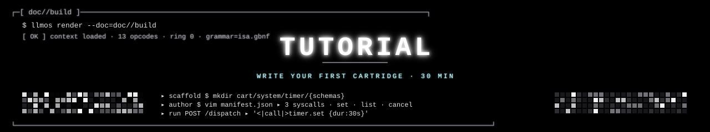

<p align="center">
  
</p>

<p align="center">
  <strong>Tutorial</strong> &nbsp;//&nbsp; write your first cartridge &nbsp;//&nbsp; <code>cart/system/timer</code>
</p>

<p align="center">
  
</p>

> 30-minute walkthrough. By the end you'll have a working `system.timer`
> cartridge mounted in `iod` with three syscalls (`set`, `list`, `cancel`),
> per-method JSON-Schema validation, an optional dialect for the hot
> path, and an end-to-end smoke test that drives it from `/dispatch`.

We'll model a simple **timer** cartridge — the LLM should be able to
schedule a timer, list pending timers, and cancel one. Same recipe
applies to any cartridge.

---

## ▸ §0 prerequisites

Make sure the kernel boots first:

```bash
cd llm_os
./scripts/quickstart.sh
# you should see "8.2 Hz steady" and "6 mounted"
```

If that works, you're ready.

<p align="center">
  
</p>

## ▸ §1 scaffold the cartridge

```bash
mkdir -p cart/system/timer/schemas
cd cart/system/timer
```

Layout we'll fill in:

```
cart/system/timer/
├── manifest.json           # name + methods + tier + capabilities
├── schemas/
│   ├── set.args.schema.json    # input schema for `set`
│   ├── list.args.schema.json   # (empty object — list takes no args)
│   ├── cancel.args.schema.json # input schema for `cancel`
│   └── shared.schema.json      # shared definitions (optional)
└── dialect.gbnf            # optional · token-compressed shorthand
```

The handler itself goes in `runtime/handlers.rs` for v0.5; in v1.0 each
cartridge ships its own `.wasm` (see
[`NEXT_STEPS.md §4`](NEXT_STEPS.md)).

<p align="center">
  
</p>

## ▸ §2 write the manifest · `manifest.json`

```json
{
  "name": "system.timer",
  "version": "0.1.0",
  "description": "Schedule, list, cancel one-shot timers.",
  "methods": [
    { "name": "set",    "args_schema": "schemas/set.args.schema.json"    },
    { "name": "list",   "args_schema": "schemas/list.args.schema.json"   },
    { "name": "cancel", "args_schema": "schemas/cancel.args.schema.json" }
  ],
  "preferred_tier": "local",
  "capabilities": {
    "requires": ["clock_monotonic"],
    "grants":   []
  },
  "max_concurrent_timers": 64
}
```

### what the fields mean

| Field | Meaning |
|---|---|
| `name` | The dotted syscall prefix. The LLM emits `<\|call\|>system.timer.set ...`. |
| `methods[].args_schema` | Path (relative to the cartridge dir) to the JSON-Schema for that method's args. The daemon enforces this *before* invoking the handler. |
| `preferred_tier` | `local` or `cloud`. Routing override; the request can still pin a different tier per-dispatch (see [`USAGE.md §5`](USAGE.md)). |
| `capabilities.requires` | What this cartridge needs from the host (e.g. clock, filesystem read, network). The mask checks before mount. |
| `capabilities.grants` | What downstream cartridges this one is allowed to call. Empty = no fan-out. |

<p align="center">
  
</p>

## ▸ §3 write the schemas

### `schemas/set.args.schema.json`

```json
{
  "$schema": "http://json-schema.org/draft-07/schema#",
  "title": "TimerSetArgs",
  "type": "object",
  "required": ["duration_ms", "label"],
  "properties": {
    "duration_ms": {
      "type": "integer",
      "minimum": 1,
      "maximum": 86400000,
      "description": "Timer duration in milliseconds (max 24h)."
    },
    "label": {
      "type": "string",
      "minLength": 1,
      "maxLength": 64,
      "description": "Human-readable label for the timer."
    },
    "callback": {
      "type": "string",
      "enum": ["beep", "log", "fault"],
      "default": "log",
      "description": "What the daemon does when the timer fires."
    }
  },
  "additionalProperties": false
}
```

### `schemas/list.args.schema.json`

```json
{
  "$schema": "http://json-schema.org/draft-07/schema#",
  "title": "TimerListArgs",
  "type": "object",
  "additionalProperties": false
}
```

### `schemas/cancel.args.schema.json`

```json
{
  "$schema": "http://json-schema.org/draft-07/schema#",
  "title": "TimerCancelArgs",
  "type": "object",
  "required": ["timer_id"],
  "properties": {
    "timer_id": {
      "type": "string",
      "pattern": "^t_[a-z0-9]{8}$"
    }
  },
  "additionalProperties": false
}
```

The schemas are the **type signatures**. The daemon turns each
`args_schema` into a per-method GBNF subgrammar so the sampler emits a
syntactically-correct call shape; then the validator double-checks
semantics.

<p align="center">
  
</p>

## ▸ §4 add a dialect (optional but recommended)

For high-frequency cartridges, the verbose JSON wire format burns
tokens. Add a dialect:

### `dialect.gbnf`

```gbnf
# Shorthand for system.timer.set:
#   T 30000 wash      ⇒  {"duration_ms":30000,"label":"wash","callback":"log"}
#   T 5000 ping beep  ⇒  {"duration_ms":5000, "label":"ping","callback":"beep"}

timer-set-call ::=
    "T " int " " label (" " callback)?

int          ::= [0-9]+
label        ::= [a-zA-Z][a-zA-Z0-9_-]*
callback     ::= "beep" | "log" | "fault"
```

The dialect parser canonicalizes both forms before schema validation
(see [`runtime/dialect.rs`](../runtime/dialect.rs)). On a Pi 5 each
saved token is a saved cycle — see
[`ARCHITECTURE.md §7`](ARCHITECTURE.md).

<p align="center">
  
</p>

## ▸ §5 write the handler

For v0.5, handlers live in [`runtime/handlers.rs`](../runtime/handlers.rs).
Open that file and add:

```rust
// runtime/handlers.rs

use std::sync::Mutex;
use std::time::{Duration, Instant};
use serde::{Deserialize, Serialize};
use serde_json::{json, Value};
use crate::cartridge::{HandlerResult, HandlerError};

#[derive(Clone)]
struct Timer {
    id: String,
    label: String,
    fires_at: Instant,
    callback: String,
}

static TIMERS: Mutex<Vec<Timer>> = Mutex::new(Vec::new());

#[derive(Deserialize)]
struct SetArgs {
    duration_ms: u64,
    label: String,
    #[serde(default = "default_callback")]
    callback: String,
}

fn default_callback() -> String { "log".to_string() }

pub fn handle_system_timer_set(args: Value) -> HandlerResult {
    let args: SetArgs = serde_json::from_value(args)
        .map_err(|e| HandlerError::SchemaViolation(e.to_string()))?;

    let id = format!("t_{:x}", rand::random::<u32>());
    let timer = Timer {
        id: id.clone(),
        label: args.label.clone(),
        fires_at: Instant::now() + Duration::from_millis(args.duration_ms),
        callback: args.callback,
    };
    TIMERS.lock().unwrap().push(timer);

    Ok(json!({
        "ok": true,
        "timer_id": id,
        "fires_in_ms": args.duration_ms,
    }))
}

pub fn handle_system_timer_list(_args: Value) -> HandlerResult {
    let now = Instant::now();
    let timers: Vec<_> = TIMERS.lock().unwrap().iter()
        .filter(|t| t.fires_at > now)
        .map(|t| json!({
            "timer_id": t.id,
            "label":    t.label,
            "remaining_ms": (t.fires_at - now).as_millis(),
        }))
        .collect();
    Ok(json!({ "ok": true, "timers": timers }))
}

#[derive(Deserialize)]
struct CancelArgs { timer_id: String }

pub fn handle_system_timer_cancel(args: Value) -> HandlerResult {
    let args: CancelArgs = serde_json::from_value(args)
        .map_err(|e| HandlerError::SchemaViolation(e.to_string()))?;
    let mut t = TIMERS.lock().unwrap();
    let before = t.len();
    t.retain(|x| x.id != args.timer_id);
    let removed = before - t.len();
    Ok(json!({ "ok": removed > 0, "removed": removed }))
}
```

Now register the handlers in the dispatch table — find the `mount`
function and add:

```rust
// runtime/handlers.rs · in pub fn mount(...)
table.register("system.timer.set",    handle_system_timer_set);
table.register("system.timer.list",   handle_system_timer_list);
table.register("system.timer.cancel", handle_system_timer_cancel);
```

<p align="center">
  
</p>

## ▸ §6 write tests

### grammar fixtures

Add fixtures to [`grammar/tests/legal/`](../grammar/tests/legal/):

```
grammar/tests/legal/05_timer_set_and_list.txt
─────────────────────────────────────────────
<|call|>system.timer.set {"duration_ms":30000,"label":"wash"} <|/call|>
<|result|>{"ok":true,"timer_id":"t_a7f3b2c1","fires_in_ms":30000}<|/result|>
<|call|>system.timer.list {} <|/call|>
<|result|>{"ok":true,"timers":[{"timer_id":"t_a7f3b2c1","label":"wash","remaining_ms":29984}]}<|/result|>
<|halt|>status=success
```

And a couple of illegal cases — for example
[`grammar/tests/illegal/05_timer_no_args.txt`](../grammar/tests/illegal/):

```
<|call|>system.timer.set <|/call|>     # no args object — must fail
```

Run the validator:

```bash
./scripts/validate_grammar.sh
# expect 13/13 (or whatever your new total is) green
```

### handler unit test

Add to [`runtime/tests/`](../runtime/tests/):

```rust
// runtime/tests/timer.rs
use llm_os::handlers::{handle_system_timer_set, handle_system_timer_list};
use serde_json::json;

#[test]
fn timer_set_and_list() {
    let r = handle_system_timer_set(json!({
        "duration_ms": 5000, "label": "test"
    })).expect("set ok");
    assert!(r["ok"].as_bool().unwrap());
    let id = r["timer_id"].as_str().unwrap().to_string();

    let r = handle_system_timer_list(json!({})).expect("list ok");
    let timers = r["timers"].as_array().unwrap();
    assert!(timers.iter().any(|t| t["timer_id"] == id));
}

#[test]
fn timer_set_rejects_negative() {
    let r = handle_system_timer_set(json!({
        "duration_ms": -1, "label": "bad"
    }));
    assert!(matches!(r, Err(_)));
}
```

```bash
cargo test --release --test timer
```

<p align="center">
  
</p>

## ▸ §7 boot + test the dispatch

```bash
# Reboot the daemon so it picks up the new cartridge:
./scripts/quickstart.sh

# Or, if it's already running:
killall iod
cargo build --release
./target/release/iod --listen unix:///run/llm_os/iod \
                    --backend http://localhost:8081 \
                    --cart-dir cart/ &

# Verify the cartridge mounted:
curl http://localhost:8080/cartridges | jq '.[] | select(.name=="system.timer")'
```

Expected:
```json
{
  "name": "system.timer",
  "version": "0.1.0",
  "methods": ["set", "list", "cancel"],
  "preferred_tier": "local",
  "mounted_at": "2026-04-26T17:12:33Z"
}
```

Now drive a goal that exercises it:

```bash
curl -X POST http://localhost:8080/dispatch -d '{
  "goal": "Set a 30-second timer labeled 'wash', then list pending timers."
}'
```

Trace excerpt:

```json
"ops": [
  {"op":"think","len_chars":52},
  {"op":"call","cart":"system.timer.set",
   "args":{"duration_ms":30000,"label":"wash"},
   "schema_ok":true,"result_ms":2,
   "result":{"ok":true,"timer_id":"t_a7f3b2c1"}},
  {"op":"call","cart":"system.timer.list",
   "args":{}, "schema_ok":true,"result_ms":1,
   "result":{"ok":true,"timers":[{"timer_id":"t_a7f3b2c1","label":"wash","remaining_ms":29984}]}},
  {"op":"halt","status":"success"}
]
```

<p align="center">
  
</p>

## ▸ §8 try the dialect

If you wrote `dialect.gbnf` in §4, the model can also emit:

```
<|call|>system.timer.set T 5000 ping beep <|/call|>
```

The dialect parser expands this into the JSON form internally before
schema validation. Tokens used: ~6 vs ~22 for the verbose form — a
**3.5× speedup** on a Pi 5 for high-rate timer scheduling.

To force the dialect path in tests, add a dispatch hint:

```bash
curl -X POST http://localhost:8080/dispatch -d '{
  "goal": "Set a 5-second ping with beep callback.",
  "prefer_dialect": true
}'
```

<p align="center">
  
</p>

## ▸ §9 commit

```bash
git add cart/system/timer \
        runtime/handlers.rs \
        runtime/tests/timer.rs \
        grammar/tests/legal/05_timer_*.txt \
        grammar/tests/illegal/05_timer_*.txt
git commit -m "feat(cart): add system.timer · set/list/cancel · dialect + schemas + tests"
```

Per the contributor checklist, every cartridge PR should:

- ✅ pass `./scripts/validate_grammar.sh` (all fixtures green)
- ✅ pass `cargo test --release`
- ✅ include at least one legal grammar fixture per method
- ✅ include at least one illegal grammar fixture
- ✅ include a handler unit test for happy + error paths
- ❌ not introduce new `cargo` dependencies without justification

<p align="center">
  
</p>

## ▸ §10 what you've just built

You added a fully working syscall to `llm_os` in under 30 minutes,
**without touching any of these things**:

- The grammar (it generalizes by composition — your schema becomes a
  per-call sub-grammar via [`schema_to_gbnf.rs`](../runtime/schema_to_gbnf.rs)).
- The dispatch loop, the parser, the scheduler, the capability mask.
- The bootloader, llama.cpp, the KV cache.

That separation is the whole point. Each new cartridge adds capability
without expanding the kernel attack surface. In v1.0 (see
[`NEXT_STEPS.md §4`](NEXT_STEPS.md)) cartridges will run inside a
WASM sandbox, making this isolation a real Ring-3 boundary rather than
a same-process convention.

<p align="center">
  
</p>

## ▸ §11 where to go next

- [`USAGE.md`](USAGE.md) — operator guide for inspection, troubleshooting,
  policy mask manipulation.
- [`ARCHITECTURE.md`](ARCHITECTURE.md) — the *why* behind every layer
  you wired into.
- [`NEXT_STEPS.md`](NEXT_STEPS.md) — where the kernel goes from v0.5 to
  v1.0. Most relevant to cartridge authors: §4 (WASM sandbox) and §6
  (single-token tokenizer fine-tune).

<p align="center">
  
</p>

<p align="center">
  
</p>

<p align="center">
  <sub><code>// BUILD.SUCCESS // 11 STEPS · system.timer · KERNEL://llm_os</code></sub>
</p>
